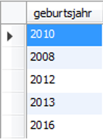
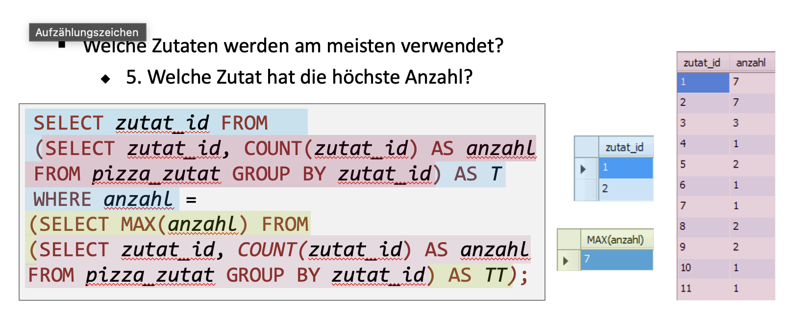

tags:: Datenbank

- # DISTINCT
  collapsed:: true
	- DISTINCT = eindeutig
	- Falls nur eindeutige Werte verlangt sind, ist ein **DISTINCT** die bessere Lösung
	- DISTINCT wird häufig bei Unterabfragen verwendet, um die Performance zu verbessern, damit nicht über doppelte Werte Abfragen getätigt werden.
	- Mit **DISTINCT** können Werte so gefiltert werden, dass diese nur einmal in der Ausgabe vorkommen
	- ```sql
	  SELECT DISTINCT(geburtsjahr) FROM katze;
	  ```
	- 
	-
- # GROUP BY
  collapsed:: true
	- Falls für diese eindeutigen Werte noch die Anzahl (COUNT) verlangt wird, muss mit einem **GROUP BY ** gearbeitet werden
	- ```sql
	  SELECT geburtsjahr, COUNT(geburtsjahr)
	  FROM katze
	  GROUP BY geburtsjahr;
	  ```
	- 
	-
- # IN
  collapsed:: true
	- Ermöglicht mehrere Vergleiche gleichzeitig
	- ```sql
	  SELECT vorname FROM mitarbeiter
	  WHERE nachname IN ('Berger', 'Blaser', 'Cartman');
	  ```
	- Anderseits müssten wir folgendes schreiben
	- ```sql
	  SELECT vorname FROM mitarbeiter
	  WHERE nachname = 'Berger' OR
	        nachname = 'Blaser' OR
	        nachname = 'Cartman';
	  ```
- # NOT IN
  collapsed:: true
	- Ermöglicht mehrere  **NOT** Vergleiche gleichzeitig
	- ```sql
	  SELECT vorname FROM mitarbeiter
	  WHERE nachname NOT IN ('Berger', 'Blaser', 'Cartman');
	  ```
	- Anderseits müssten wir folgendes schreiben
	- ```sql
	  SELECT vorname FROM mitarbeiter
	  WHERE nachname != 'Berger' AND
	        nachname != 'Blaser' AND
	        nachname != 'Cartman';
	  ```
- # UNTERABFRAGEN
	- ## Beispiel Datenbank
	  collapsed:: true
		- 
	- ## Welche Zutaten werden am meisten verwendet?
		- ### Schritt 1
		  collapsed:: true
			- 
		- ### Schritt 2
		  collapsed:: true
			- 
		- ### Schritt 3
		  collapsed:: true
			- 
		- ### Schritt 4
		  collapsed:: true
			- 
		- ### Schritt 5
		  collapsed:: true
			- 
		- ### Schritt 6
		  collapsed:: true
			- 
		- ### Schritt 7
		  collapsed:: true
			- 
		- ### Schritt 8
		  collapsed:: true
			- 
			- 
			-
				-