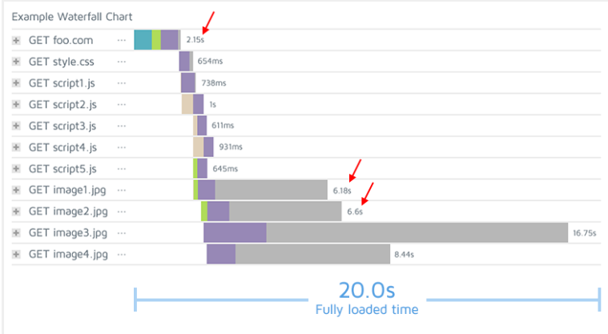

tags:: [[Chrome]], [[Chrome Developer Tools]]

- Shows **how resources load** (HTML, CSS, JS, images) over time.  This help identify which parts of the page are **slow** and need **optimization**
  background-color:: blue
-
- The Network Waterfall breaks down **each request** made by a web page, showing:
  | Info | Description |
  | ---- | ---- | ---- |
  | **URL** | The resource being requested (e.g. HTML, CSS, JS, images, fonts). |
  | **Status** | HTTP status code (e.g. 200, 404, 301). |
  | **Type** | Type of file or request (e.g. document, script, stylesheet, image). |
  | **Initiator** | What triggered the request (e.g. parser, script). |
  | **Size** | Size of the downloaded resource. |
  | **Time** | How long it took to load the resource. |
  | **Waterfall** | A visual timeline showing when and how long each resource took to load. |
-
- {:height 253, :width 628}
-
- 